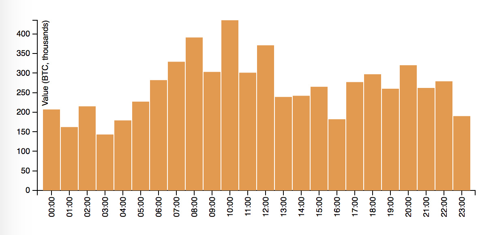

# Websocket client for blockchain data, with integration into GemFire and GPDB

## Ideas for applications

* Graph analysis of blockchain transactions
* Plot transaction volumes over time, overlaid onto other data (news, commodities, gold, stock market indexes)
* Plot blockchain / USD value over time, possibly correlated as above
* Look for features indicative of the rebalancing adjustment made approximately every 14 days

## Components with function

1. Spring Boot app
    * Pulls in blockchain transaction data via a websocket
    * Stores that into GemFire
    * Serves the stream up via its own websocket server

1. GemFire
    * Stores data in memory for real time dashboard (histogram, etc.)
    * WAN replicated across > 1 IaaS (AWS, Azure, Google Cloud)
    * Uses an _AsyncEventListener_ to push Blockchain Transactions into an S3 bucket

1. GPDB
    * Warm data in heap tables
    * Cold data in S3 bucket (see note on S3, above)
    * Large scale analytical queries, statistical, and machine learning analysis

## External dependencies

1. Data source: `wss://ws.blockchain.info/inv`

1. Java websocket library must be downloaded, built, and installed:
    ```
    $ git clone https://github.com/TooTallNate/Java-WebSocket.git
    $ cd ./Java-WebSocket/
    $ mvn clean install
    ```

## Install, configure, and start GemFire

* Save this directory: `pushd .`
* Download the archive from Pivotal Network
* Extract somewhere: `cd /opt/ ; sudo unzip ~/Downloads/pivotal-gemfire-9.1.1`
* Set `PATH`: `cd ./pivotal-gemfire-9.1.1/ ; export PATH=$PWD/bin:$PATH`
* Change back into this GitHub repo directory: `popd`
* Start a locator: `gfsh -e "start locator --name=locator --classpath=$PWD/target/classes"`
* Edit the [server cache XML file](./src/main/resources/serverCache.xml), replacing the following tokens with appropriate values: `us-west-2, YOUR_S3_BUCKET_NAME, YOUR_S3_ACCESS_KEY_ID, YOUR_S3_SECRET_KEY`
* Generate the string passed via `--classpath=` when staring the server: `./generate_classpath_for_gemfire_server.sh`.  That last line of output is what you replace `CLASSPATH` with in the next step.  This step basically dumps all JAR file dependencies into the `./lib` directory of this project (it also creates this directory).
* Start a server: `gfsh -e "start server --name=server --cache-xml-file=./src/main/resources/serverCache.xml --locators=localhost[10334] --classpath=CLASSPATH"`
* Start up the Pulse web UI: `gfsh -e "start pulse"`
* This should direct your browser to the Pulse UI, where you enter _admin_ for user name, and _admin_ for password

## Install, configure, and start Greenplum Database (GPDB)

* Use the [GPDB marketplace offering](https://aws.amazon.com/marketplace/pp/B06XKQ8Z3H) in AWS
* Follow the directions there
* Run the relevant DDL operations in [this file](./sql/blockchain.sql)
* This client app here assumes GPDB is accessible on `localhost`, so you will need to create an SSH tunnel; here's an example:
```
  ssh -i ./your_vm_ssh_key.pem -f gpadmin@11.22.33.44 -L 10432:localhost:10432 -N
```
That will fork and run in the background
* If you need to alter the credentials, host, or port, do that [here](./src/main/resources/application.properties)

## Build this app

1. Edit the [properties file](./src/main/resources/application.properties) to suit your installation

1. Build: `./mvnw clean package -DskipTests`

1. Run: `java -jar ./target/blockchain-wss-client-0.0.1-SNAPSHOT.jar` (or, use [this](./start_blockchain_app.sh))

**NOTE:** this app listens on ports 8080 (HTTP) and 18080 (WS server)

## Available endpoints
* `http://server:port/` provides the animated view of Bitcoin transactions
* `http://server:port/graph_volume_vs_hour.html` yields a graph of transaction volumes across the hours in the day



## Data sample

```
{
  "op" : "utx",
  "x" : {
    "lock_time" : 492679,
    "ver" : 2,
    "size" : 226,
    "inputs" : [ {
      "sequence" : 4294967294,
      "prev_out" : {
        "spent" : true,
        "tx_index" : 297367747,
        "type" : 0,
        "addr" : "1Mo9qpihFTvJBE1vEh1p1bxuGKgnkg9at",
        "value" : 739787106,
        "n" : 0,
        "script" : "76a91403eed86942c88cd2669d3e94e34babe024ffa8dd88ac"
      },
      "script" : "483045022100ce192f3d8cdb1fb11a056369df83b86924b982bebcfceb5786cb2a8e07e7d2c402206ea1b5d80c3b457967a6dc84e54992875d4d2a7da5c71bc3137f2ce9521fc7e6012102c5ce11d10ac960fd0004a9d3c1ca736fab9821ecdaecd31262e0e42120d91cf9"
    } ],
    "time" : 1509613962,
    "tx_index" : 297369076,
    "vin_sz" : 1,
    "hash" : "138df026f4db0d38aae2d06091eb235170f6199a01c7303507dc72d131ca684f",
    "vout_sz" : 2,
    "relayed_by" : "0.0.0.0",
    "out" : [ {
      "spent" : false,
      "tx_index" : 297369076,
      "type" : 0,
      "addr" : "1KgcEX7mYJVy4qJqjjq2a8qCXUEgxSxY36",
      "value" : 738483656,
      "n" : 0,
      "script" : "76a914ccefe5d1055c51cbbba2d3515b92957e7081c9da88ac"
    }, {
      "spent" : false,
      "tx_index" : 297369076,
      "type" : 0,
      "addr" : "1Ek6E3PdfsfkuyCdjgCoKstesqiQ3t2hM6",
      "value" : 1258250,
      "n" : 1,
      "script" : "76a91496bfe20e3f51cd0c7f7543f2c0ceafdb4b97b81888ac"
    } ]
  }
}
```

## Potentially Useful References
* An OReilly [title](http://chimera.labs.oreilly.com/books/1234000001802/ch05.html#tx_lifecycle)
* To redirect from a Spring Boot endpoint to our WS server, you can just return `redirect:<uri>` from a `@Controller`, or a `RedirectView`
* A [note](https://stackoverflow.com/questions/39202243/how-to-create-composite-primary-key-scenario-in-gemfire-region) on composite primary keys in Gemfire
* Video: [Demystifying High Availability with Apache Geode](https://youtu.be/yachT1xoQww)
* Video: [How To Download and Run Apache Geode](https://youtu.be/zpko_fROWrU)
* [GitHub repo](https://github.com/kdunn926/blockchainviz) for the Javascript UI
* Export data from a region: `gfsh>export data --region=/BlockchainItem --file=/tmp/BlockchainItem.gfd --member=server`
* Import data to a region: `gfsh>import data --region=/BlockchainItem --file=/tmp/BlockchainItem.gfd --member=server`
* Connect to a locator (from gfsh): `gfsh>connect --locator=localhost[10334]`
* [MADlib's graph algorithms](http://madlib.apache.org/docs/latest/group__grp__graph.html)
* D3.js [bar graph example](http://bl.ocks.org/d3noob/8952219)
* An [article](http://www.baeldung.com/spring-scheduled-tasks) on the Spring `@Scheduled` annotation

